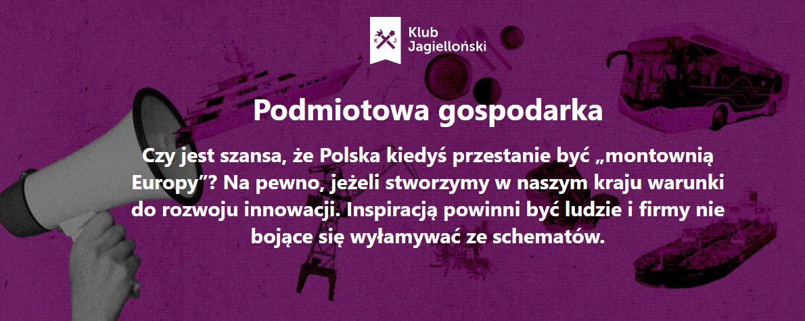

E. Wedel a właściwie teraz Lotte Wedel Sp. z o.o. to najstarsza w Polsce fabryka czekolady, która została założona przez Karola Wedla. Po roku 1989 zaczęto proces prywatyzacji spółki. W wyniku tego aplikacja Pola przyznaje 55 pkt na możliwe 100.

Najczęściej skanowaną czekoladą w naszej aplikacji jest E. Wedel Czekolada gorzka 100g o kodzie 5901588016030 z liczbą 8182 skanowań. Natomiast produktem Lindt’a, który był najwięcej razy skanowany jest Lindt Excellence 85% czekolada ciemna 100 g z kodem 3046920028363 i 648 liczbą skanowań. Jeden z najbardziej znanych producentów czekolady na świecie otrzymał zgodnie z punktacją Poli 10 pkt.

**„Colian to polska grupa kapitałowa, w której zdecydowaną większość udziałów posiada rodzina Kolańskich. Należy do niej kilka marek oferujących słodycze, bakalie, napoje, przyprawy itp. Siedziba Grupy Colian znajduje się w Opatówku k. Kalisza. Tam mieści się też jeden z zakładów produkcyjnych. Pozostałe fabryki działają w Bydgoszczy, Poznaniu, Lublinie, Kaliszu i Wykrotach. Colian konsekwentnie realizuje ekspansję na rynki zagraniczne.”.** - taki opis firmy [możemy znaleźć](https://www.pola-app.pl/) skanując marki należące do grupy Colian w aplikacji Pola. Są to między innymi takie nazwy handlowe jak Helena, Goplana, appetita, Solidarnosć czy Jeżyki.

Najczęściej skanowanymi czekoladami były:

- E. Wedel Czekolada gorzka 100 g (8182 skanowań)
- Wawel Gorzka Czekolada 100 g (7655 skanowań)
- E. Wedel Czekolada mleczna 100 g (5246 skanowań)
- Colian Czekolada Klasyczna Gorzka 90g (3821 skanowań)
- Goplana Oryginalna mleczna Czekolada 90 g (3219 skanowań)

O tym dlaczego warto korzystać z naszej aplikacji, pisaliśmy na łamach portalu Klubu Jagiellońskiego, wydawcy aplikacji Pola w dziale [Podmiotowa Gospodarka](https://klubjagiellonski.pl/2021/11/23/10-milionow-patriotycznych-wyborow-konsumenckich-ranking-100-najczesciej-skanowanych-firm-w-aplikacji-pola/).

### Czegoś zabrakło? Chcesz wiedzieć więcej? Napisz do nas **pola@klubjagiellonski.pl** lub daj znać w mediach społecznościowych [facebook](https://www.facebook.com/app.pola), [twitter](https://twitter.com/pola_app).
