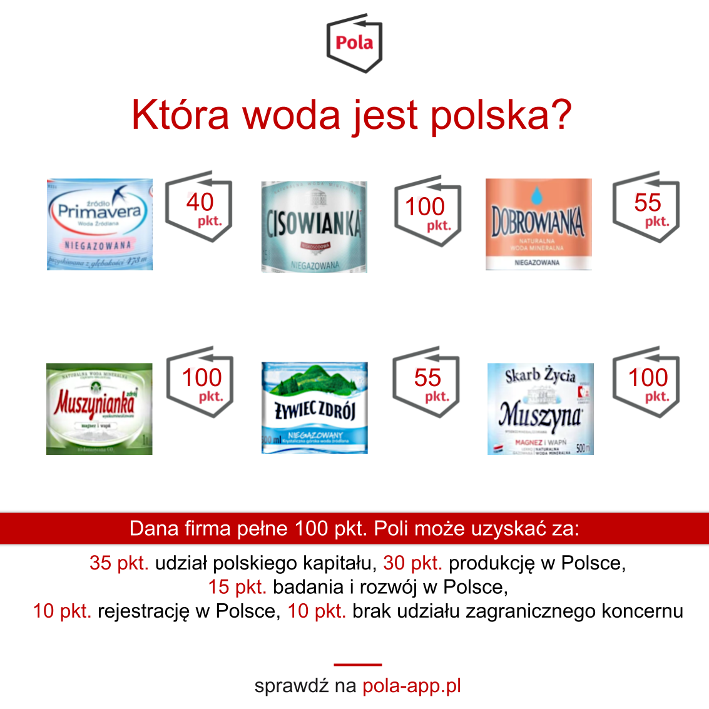

Wbrew pozorom mamy wiele butelkowanych wód, które pochodzą z polskich źródeł a ich producent jest reprezentowany przez w pełni polski kapitał. Są to między innymi przedstawione w naszym zestawieniu Cisowianka, Muszynianka, Skarb Życia Muszyna ale także Piwniczanka i Polaris produkowany przez Bewa sp. z o.o..

 Niekwestionowanym liderem w ilości skanowań jest Muszynianka Naturalna woda mineralna wysokozmineralizowana magnezowo-wapniowa w wersji 1,5l, która jest produkowana przez spółkę Muszynianka. Przez blisko 70 lat działała w formie spółdzielni pracy, dopiero w 2019 roku firmę przekształcono w spółkę z ograniczoną odpowiedzialnością. W aplikacji Pola spółka może pochwalić się 100 punktami.

Podobnie wysoką ocenę otrzymuje u nas Cisowianka, która jest wytwarzana przez Nałęczów Zdrój sp. z o.o..**„Producent wody Cisowianka, której historia zaczęła się w 1979 roku, kiedy to po raz pierwszy została ona wydobyta ze złóż wodonośnych na Lubelszczyźnie. Spółka rozwija swoją działalność również na rynkach międzynarodowych - szczególnie w zakresie marki Cisowianka Perlage.”.** - taki opis firmy [możemy znaleźć](https://www.pola-app.pl/) skanując produkty spółki aplikacją Pola.

W aplikacji najczęściej skanowano wodę:

- Muszynianka Naturalna woda mineralna wysokozmineralizowana magnezowo-wapniowa (32501 skanowań)
- Cisowianka Naturalna woda mineralna niegazowana niskosodowa (31062 skanowań)
- Żywiec Zdrój Woda niegazowana (24562 skanowań)
- Cisowianka Naturalna woda mineralna lekko gazowana niskosodowa (14719 skanowań)
- Muszyna Skarb Życia Naturalna woda mineralna wysokozmineralizowana lekko gazowana (14373 skanowań)

Jeżeli nadal zastawiasz się czy korzystać z aplikacji Pola, sprawdź, dlaczego powinieneś w artykule Klubu Jagiellońskiego [Podmiotowa Gospodarka](https://klubjagiellonski.pl/2020/05/22/5-mitow-patriotyzmu-gospodarczego-produkt-polski-i-590-vs-aplikacja-pola-video/).

### Czegoś zabrakło? Chcesz wiedzieć więcej? Napisz do nas **pola@klubjagiellonski.pl** lub daj znać w mediach społecznościowych [facebook](https://www.facebook.com/app.pola), [twitter](https://twitter.com/pola_app).
