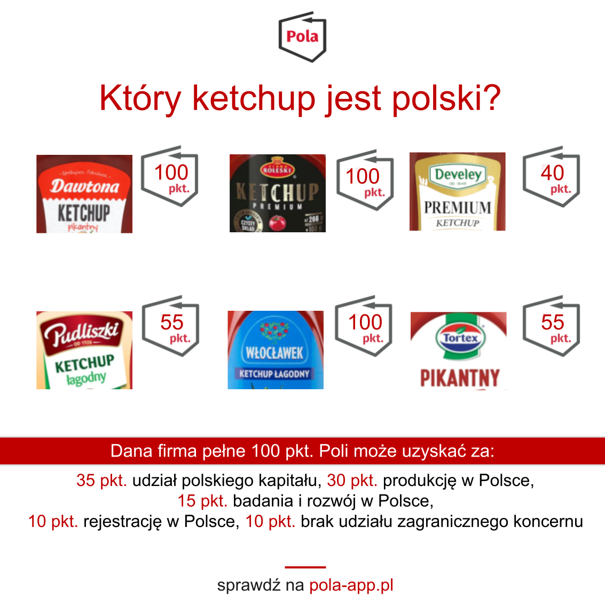

Jeżeli kiedykolwiek zastanawiałeś się gdzie jest najwięcej zakładów produkcyjnych ketchupu to odpowiedź brzmi w Wielkopolsce. Heinz i Pudliszki mają swój zakład w Pudliszkach (kto by się spodziewał). W Poznaniu produkowany jest Tortex i ketchup marki Hellman’s. W okolicy bo w Kotlinie produkowany jest ketchup marki Kotlin a w Międzychodzie - ketchup Międzychód. Jak widać, lubimy nazywać ketchupy od miejsca ich pochodzenia.

 O miano najlepszego ketchupu i majonezu walczy wiele produktów. Nie raz pewnie przy niejednym rodzinnym stole doszło do kłótni zwolenników różnych marek. Jeżeli chodzi o mnie sentymentem darzę wszystkie produkty marki Roleski w tym także ich ketchup. W aplikacji Pola otrzymuje od nas 100 pkt. Najczęściej skanowany był Ketchup markowy łagodny 450 g, który uzyskał 3585 skanowań. Tuż za nim miejsce zajmuje pikantna odmiana produktu z liczbą 3208 skanowań.

**„Zakład Przetwórstwa Owocowo Warzywnego Dawtona Danuta Wielgomas to rodzinna, polska firma działająca na rynku od 1990 roku. Dawtona zatrudnia ponad 1200 pracowników w trzech zakładach produkcyjnych, wyposażonych w najnowocześniejsze linie produkcyjne oraz własne pola uprawne w otulinie Kampinoskiego Parku Narodowego.”.** - taki opis firmy [możemy znaleźć](https://www.pola-app.pl/) skanując produkty między innymi ketchup ale też inne produkty Dawtony aplikacją Pola. Zgodnie z naszą skalą punktową przedsiębiorstwo z Błonia otrzymuje maksymalne 100 pkt.

Najwięcej sprawdziliście:

- Kotlin Ketchup łagodny 450 g (8769 skanowań)
- Pudliszki Ketchup łagodny 480 g (8607 skanowań)
- Pudliszki Ketchup łagodny 500 g (7810 skanowań)
- Kotlin Ketchup pikantny 450 g (7677 skanowań)
- Pudliszki Ketchup pikantny 480 g (6913 skanowań)

Czy warto szukać polskiego przetworzonego pomidora pisaliśmy na łamach portalu Klubu Jagiellońskiego, wydawcy aplikacji Pola w dziale [Podmiotowa Gospodarka](https://klubjagiellonski.pl/2017/10/18/wydali-2-miliony-aplikacja-ledwo-dziala-jak-rzadowa-agencja-promuje-regionalne-produkty/).

### Czegoś zabrakło? Chcesz wiedzieć więcej? Napisz do nas **pola@klubjagiellonski.pl** lub daj znać w mediach społecznościowych [facebook](https://www.facebook.com/app.pola), [twitter](https://twitter.com/pola_app).
