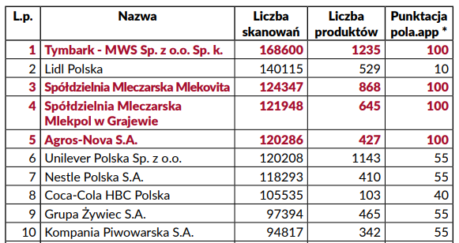

Jak wiadomo, najlepsze jabłka można dostać na polskim targu od polskiego rolnika. Jeżeli jednak chcemy kupić już przetworzone jabłka, to nie zawsze otrzymamy sok, pochodzi od polskiego producenta, czy z polskiej fabryki. Tym, że zarówno Fortuna i Tymbark otrzymały 100 pkt w naszej aplikacji, nikt nie jest zaskoczony. Jednakże fakt otrzymania przez markę Riviva, również takiej ilości może niektórych zdziwić.

Producentem Riviv’y jest Sokpol sp. z o.o. z siedzibą w Myszkowie. Jest to spółka, która od 1992 roku produkuje soki, napoje i wody mineralne. Produkują między innymi wspomniane soki, z których to najwięcej skanowań miał sok jabłkowy. Najmniej punktów w naszym zestawieniu otrzymał sok Cappy, który zgromadził ich 40. Z kolei produktem marki, która należy do grupy Coca-Cola Hellenic był skanowany jest Cappy Sok pomarańczowy 100% 1 l z liczbą 2975 skanowań.

**„Tymbark jest obecny na polskim rynku od 1936 r. Obecnie Tymbark to zdecydowany lider rynkowy w kategorii soków, nektarów i napojów w Polsce, którego produkty trafiają do prawie 30 krajów na całym świecie. W Tymbarku opracowano i zainstalowano pierwszą w Polsce stację wyparną do zagęszczania soków, opracowano w 1967 roku pierwszą w Polsce recepturę soku z czarnej porzeczki oraz wprowadzono w 2004 roku Top Aseptic – nowoczesną technologię aseptycznego rozlewu soków i napojów do opakowań plastikowych.”.** - taki opis firmy [możemy znaleźć](https://www.pola-app.pl/) skanując produkty jednej z najbardziej rozpoznawalnych polskich marek aplikacją Pola.

Tymbark to również najczęściej skanowana firma w historii aplikacji Pola. Z okazji 10 milionów skanowań dokonanych za pomocą aplikacji Pola, opublikowaliśmy zestawienie najczęściej skanowanych firm, w którym pierwsze miejsce zajął Tymbark.

W kategorii soków najwięcej skanowań uzyskały:

- Tymbark sok pomarańczowy 100% bez dodatku cukru 1 l (11 611 skanowań)
- Hortex Pomarańcza Sok 100% 1 l (6177 skanowań)
- Tymbark Jabłko Sok 100% 1 l (4846 skanowań)
- Sok jabłkowy RIVIVA z Biedronki (4059 skanowań)
- Dawtona Sok pomidorowy 330 ml (3908 skanowań)

Jak istotny jest patriotyzm gospodarczy, pisaliśmy na łamach portalu Klubu Jagiellońskiego, wydawcy aplikacji Pola w dziale [Podmiotowa Gospodarka](https://klubjagiellonski.pl/2018/08/07/patriotyzm-konsumencki-na-powaznie-aplikacja-pola-startuje-ze-znakiem-towarowym/).

### Czegoś zabrakło? Chcesz wiedzieć więcej? Napisz do nas **pola@klubjagiellonski.pl** lub daj znać w mediach społecznościowych [facebook](https://www.facebook.com/app.pola), [twitter](https://twitter.com/pola_app).
