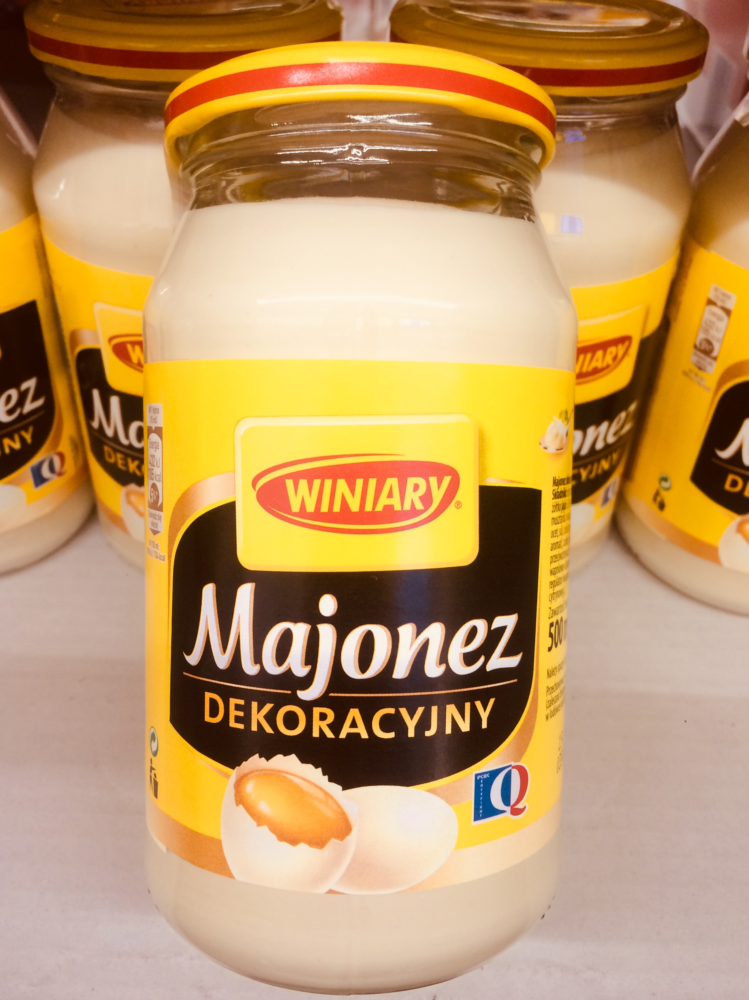
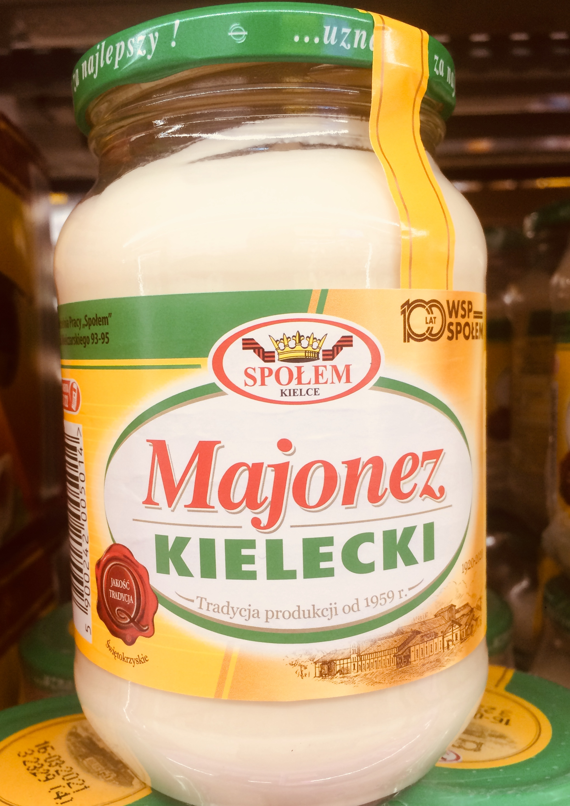
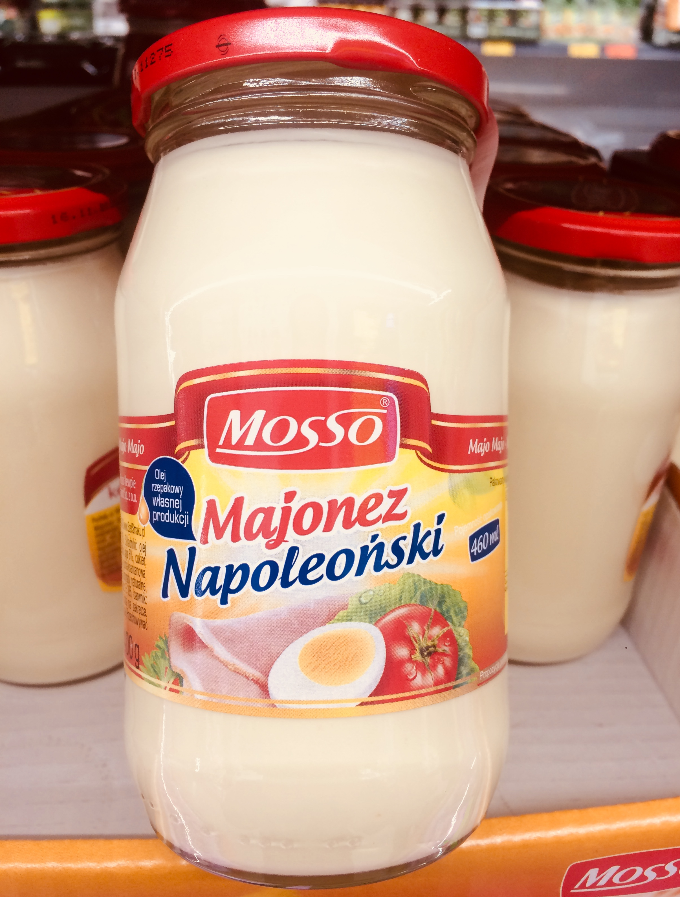
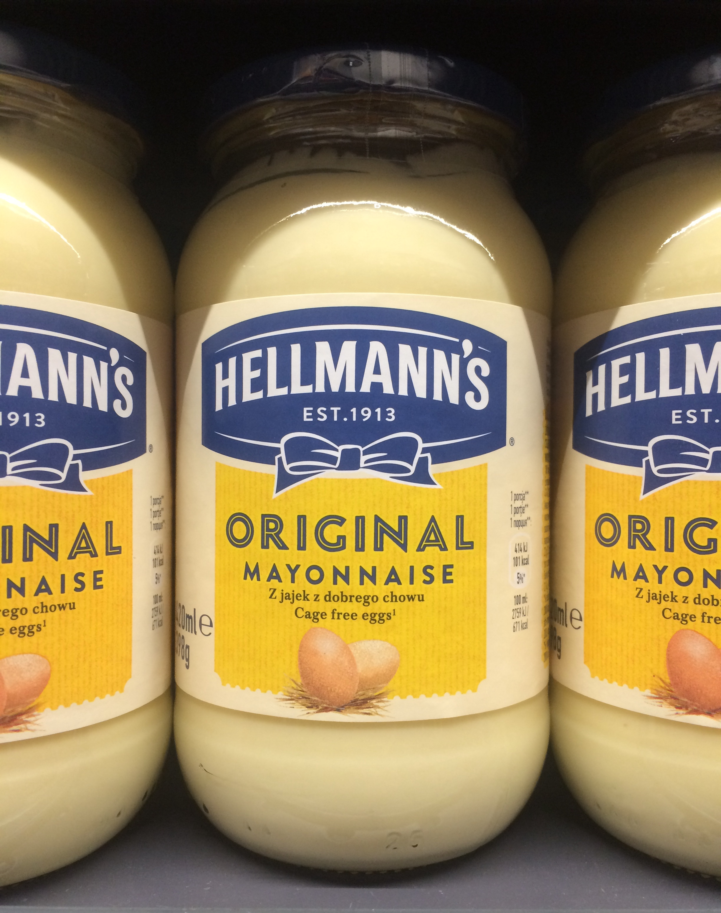
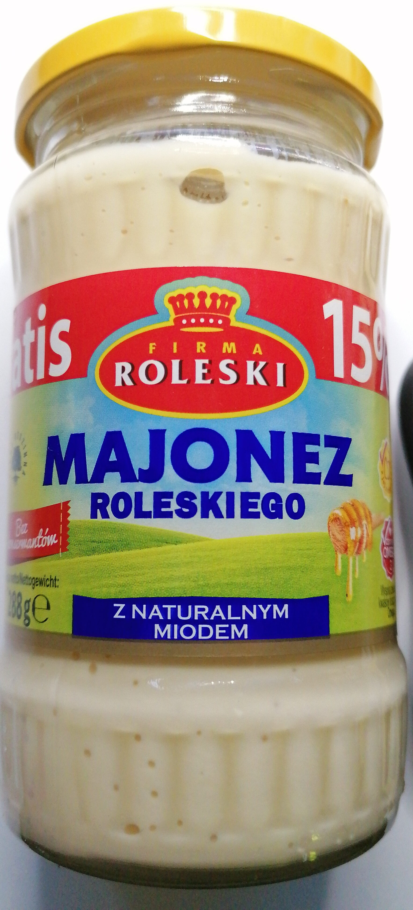

W naszej bazie znaleźć można 272 majonezy. Najpopularniejszy z nich skanowano 11 tys. razy. Sprawdź jak popularny jest ten, który Ty wybierasz najczęściej.

 Wśród 10. najczęściej skanowanych majonezów, aż cztery należą do marki Winiary, będącej częścią koncernu Nestle ocenianego przez aplikację Pola na 55 pkt.

Aplikacja Pola działa już od ponad 6. lat. Pobrano ją ponad 750 tys. razy, a liczba zeskanowanych produktów zbliża się do 10 mln.

Najczęściej skanowano majonez z kodem: 5900085011012, czyli Majonez Dekoracyjny 400 ml. Ten produkt zgromadził 11 321 skanowań. Na drugim miejscu znajduje się kod: 5900085011029, czyli Majonez Dekoracyjny Winiary 700 ml 7083 skanowań.

 Trzecią pozycję zajmuje Kielecki z kodem 5900242001566 i liczbą 7441 skanowań. Marka należy do WSP Społem ocenianej na 100 pkt.

**„WSP „Społem” to polska firma o bogatej, wieloletniej tradycji. Za symboliczną datę rozpoczęcia funkcjonowania przedsiębiorstwa przyjmuje się 15 września 1920 roku, kiedy to wyprodukowano pierwszą partię mydła gospodarczego. Na początku lat dziewięćdziesiątych firma przeszła proces przekształceń związanych z transformacją polityczno-gospodarczą kraju. Wytwórcza Spółdzielnia Pracy „Społem” stała się wtedy własnością wszystkich pracowników. Jedną z najważniejszych dat w historii firmy był rok 1959. To właśnie wtedy Spółdzielnia wyprodukowała Majonez Kielecki - pierwszy w Polsce majonez wytwarzany drogą przemysłową”.** - taki opis firmy [możemy znaleźć](https://www.pola-app.pl/#/ean/5900242001566) skanując produkty WSP Społem aplikacją Pola.

Następne pozycje również zajmują produkty WSP Społek i Nestle:

- Majonez Dekoracyjny Winiary 500 ml (6364 skanowań)
- Majonez Kielecki 500 ml (4001 skanowań)
- Majonez dekoracyjny Winiary (3275 skanowań)
- Majonez Kielecki 700 ml (2433 skanowań)
- Majonez Kielecki 170 ml (2399 skanowań)

Dziewiate miesce zajmuje kod: 5901926027018, czyli Mosso Majonez napoleoński 320 ml z liczbą 2152 skanowań. Marka należy do firmy 	MOSSO Kwaśniewscy Sp. j., która również oceniana jest na 100 pkt.

Kolejny produkt nie należący do trzech już wymienionych firm, to kod: 8718114892849, czyli Hellmann's Majonez Babuni 420 ml skanowany 1095 razy. Mraka należy do koncernu Unilever Polska Sp. z o.o., ocenianego przez aplikację Pola na 55 pkt.

Kolejna marka zajmuje 16. pozycję. To Majonez Roleski stołowy 835 g, z kodem 5901044001396 i liczbą 1032 skanowań. Firma Roleski Spółka Jawna otrzymuje w aplikacji pola 100 pkt. W opisie firmy możemy przeczytać **„Firma Roleski została założona w 1972 roku jako polskie przedsiębiorstwo rodzinne. Od początku swego istnienia związana była z rolnictwem i przemysłem spożywczym. Jako pierwsze prywatne przedsiębiorstwo w Polsce uzyskało koncesję na produkcję majonezu. Obecnie co trzeci słoiczek musztardy sprzedawany w Polsce pochodzi ze Zbylitowskiej Góry, gdzie znajduje się zakład produkcyjny Roleski. Jej właściciel, Marek Roleski został pierwszym przedsiębiorcą z Polski, który zagwarantował prawnie, że jego firma nie trafi w obce ręce. Stworzył konstytucję, która nie pozwala na to spadkobiercom.”**

Wśród 30 najpopularniejszych majonezów znajdują się również

- Majonez pomorski stołowy 260 g od Ocetix (100 pkt.) z liczbą 943 skanowań,
- Splendido Majonez Kanapkowy z liczbą 832 skanowań, należący do Develey Polska Sp. z o.o, które otrzymuje 40 pkt.
- Majonez Świdnicki 300 g z liczbą 725 skanowań, należący do P.P.H.U. M & J sp.j. Z. Jadczak, G. Maciejewska, które aplikacjia Pola ocenia na 100 pkt.
- Motyl Majonez stołowy 265 g z liczbą 625 skanowań, należący do Z.P. Owoców i Warzyw Motyl Sp. j., króry został oceniony na 100 pkt.
- Majonez kętrzyński stołowy 280 g, który zeskanowano 250 razy. Ta marka należy do Majonezy S.P.P.H. w Kętrzynie, firmy która róznież otrzymuje 100 pkt.
- Majonez klasyczny z kodem 20014421 i liczbą skanowań wynoszącą 579, który został sklasyfikowany jako marka własna sieci Lidl, ocenianej na 10 pkt.

### Czegoś zabrakło? Chcesz wiedzeić więcej? Napisz do nas [pola@klubjagiellonski.pl](mailto:pola@klubjagiellonski.pl) lub daj znać w mediach społecznościowych [facebook](https://www.facebook.com/app.pola), [twitter](https://twitter.com/pola_app).

