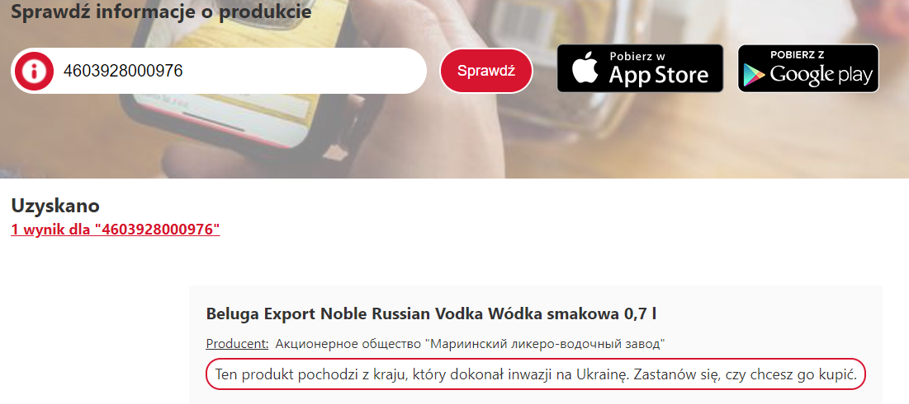

Bojkoty nie są w naszym stylu, ale wobec tego co dzieje się obecnie w Ukrainie nie można pozostać obojętnym. Otrzymaliśmy wiele wiadomości z prośbami o wprowadzenie opcji umożliwiającej rozróżnienie rosyjskich firm i produktów. Dlatego wprowadziliśmy kilka rozwiązań.

Po pierwsze przygotowaliśmy listę największych i najpopularniejszych rosyjskich i białoruskich firm, którą znajdziecie w dziale [Podmiotowa Gospodarka](https://klubjagiellonski.pl/2022/03/03/odinstaluj-kasperskyego-nie-graj-w-world-of-tanks-bojkot-rosyjskich-produktow-w-aplikacji-pola/).

Po drugie, jeśli zeskanujecie kod kreskowy produktu pochodzącego z Rosji lub Białorusi. Otrzymacie stosowne ostrzeżenie: ** Ten produkt pochodzi z kraju, który dokonał inwazji na Ukrainę. Zastanów się, czy chcesz go kupić **. Takie samo ostrzeżenie otrzymacie, wpisując kod w wyszukiwarce na naszej stronie głównej.

Mamy nadzieję, że te działania pomogą w podjęciu świadomych decyzji.

Po trzecie, zarząd Klubu Jagiellońskiego podjął decyzję, aby zawiesić zbiórkę na działalność Stowarzyszenia. W miejsce przelewu, który chciałeś nam przekazać – prześlij pieniądze ukraińskiej armii w ramach [oficjalnej zbiórki organizowanej przez Narodowy Bank Ukrainy!](https://klubjagiellonski.pl/wesprzyj-ukrainska-armie/)

