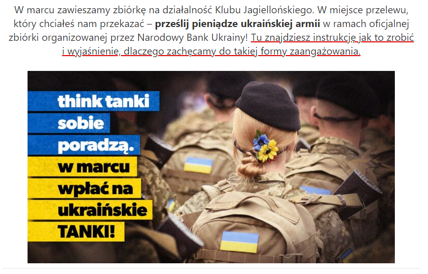

###Polski gamedev wspiera Ukraińców.

[CD Projekt](https://www.linkedin.com/company/cd-projekt-red/posts/?feedView=all) skupił się na wsparciu humanitarnym i przekazał 1 mln złotych na konto Polskiej Agencji Humanitarnej. Polski producent gier AAA zablokował także sprzedaż gier w Rosji i na Białorusi.

[11 bit studio](https://twitter.com/11bitstudios/status/1499459748097409033?ref_src=twsrc%5Egoogle%7Ctwcamp%5Eserp%7Ctwgr%5Etweet), twórcy gry This War of Mine poinformowali, że każdy zysk ze sprzedaży egzemplarza gry na każdej platformie trafi do Ukraińskiego Czerwonego Krzyża. W wyniku akcji twórcy szybko zebrali 3 mln złotych.

Techland również przekazał 1 mln zł na rzecz Polskiej Akcji Humanitarnej. „Wojna trwająca na Ukrainie sprawiła, że jesteśmy zdruzgotani i brakuje nam słów. W ciągu ostatnich kilku dni skupialiśmy uwagę na bezpieczeństwie naszych pracowników i ich rodzin, a także na ich wspieraniu. Dołączyliśmy również do starań polskiej branży gier, zmierzających do zapewnienia wsparcia Ukrainie, w związku z czym przekazaliśmy 1 mln zł dla @PAH_org” - [czytamy](https://polygamia.pl/techland-okazuje-solidarnosc-z-ukraina-przekazuje-1-mln-zl,6741860037610464a).

Wsparcia udzieliły również firm: Huuge Games, Ten Square Games i Flying Hog. Studio PlayWay natomiast udostępniło swoje biuro dla uchodźców z Ukrainy.
Zagraniczne studia takie [Activision i Blizzard](https://activisionblizzard.com/newsroom/2022/03/supporting-the-ukrainian-people) wspierają Ukraińców w walce poprzez przekazywanie środków pieniężnych do organizacji niosiących pomoc w strefie konfliktu. Więcej można przeczytać w komunikacie firmy: **Firma dopasowuje darowizny od pracowników organizacji zapewniających natychmiastową pomoc w regionie. Dzięki temu wspólnie zebraliśmy ponad 300 000 dolarów. W przyszłym tygodniu planujemy dodać do rozważenia dodatkowe organizacje charytatywne, a także zwiększymy limit dopasowania firmy z 1000 dolarów do 10 000 dolarów.**

Wesprzyj [zbiórkę na czołgi organizowaną przez Narodowy Bank Ukrainy](https://klubjagiellonski.pl/wesprzyj-ukrainska-armie/), którą Klub Jagielloński, wydawca aplikacji Pola wspiera.

Zdjęcie pochodzi z platformy [Flickr](https://www.flickr.com/)
