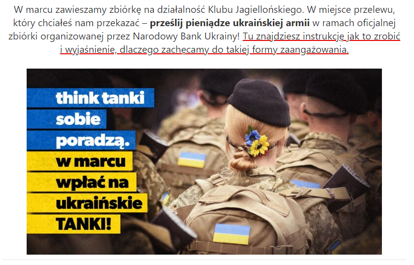

Operator telekomunikacyjny [Play](https://biuroprasowe.play.pl/aktualnosci/727886/play-wspiera-obywateli-ukrainy) poprzez swoje biuro prasowe poinformował o obniżeniu kosztów wykonywania telefonów do ukraińskich użytkowników: „W trybie natychmiastowym wdrażamy następujące kroki. Od jutra, 25 lutego: przyznajemy 120 darmowych minut na połączenia do największych ukraińskich operatorów (Kyivstar, Vodafone, Lifecell) oraz 10 GB do wykorzystania w Polsce dla klientów Play na Kartę. Dla wszystkich klientów obniżamy o ponad 80% z 29 gr/min na 5 gr/min stawkę za połączenia do największych ukraińskich operatorów (Kyivstar, Vodafone, Lifecell) aktywowaną przez klienta szybkim kodem USSD *111*201\*1#Pakiety można łączyć”. Inni operatorzy na polskim rynku, zdecydowali się na podobne ruchy.

[Grupa Polsat wraz z Fundacją Polsat](https://www.fundacjapolsat.pl/news/2022-02-28/grupa-polsat-plus-i-fundacja-polsat-razem-dla-dzieci-z-ukrainy-5-mln-zlotych-w-ramach-akcji-fundacja-polsat-dzieciom-ukrainy/) poinformowała o przekazaniu 5 mln złotych, które mają trafić do tych, którzy są najbardziej bezbronni, czyli do dzieci. Ponadto została uruchomiona zbiórka, do której każdy z nas może dołączyć: „Do inicjatywy „Fundacja Polsat Dzieciom Ukrainy” włączają się spółki z Grupy Zygmunta Solorza: Telewizja Polsat, sieć Plus, platforma Polsat Box, Netia oraz ZE PAK i na start przekażą 5 milionów złotych w ramach zbiórki, którą będzie prowadziła Fundacja Polsat”.

Jedna z najbardziej znanych w Polsce firm carsharingowych poinformowała o wyłączeniu z usługi 1000 szt. aut i użyciu ich do transportu uchodźców. W oficjalnym komunikacie firmy [Panek](https://panekcs.pl/en/aktualnosci/komunikat) opublikowanym między innymi na ich stronie możemy przeczytać:

„Przepraszamy za niedogodności w ciągu najbliższych dni, jednak zdecydowaliśmy się wyłączyć 1000 samochodów z usługi i przeznaczyć je na wsparcie w transporcie osób z granicy Ukrainy. Już dziś nasi pracownicy wyruszyli w pierwsze trasy, a akcje mamy zaplanowaną na cały weekend.
Jesteśmy z Wami, poszkodowani to również nasi pracownicy i przyjaciele 💙💛 ”

Właściciel sieci paczkomatów [InPost](https://www.linkedin.com/posts/inpost_pomocdlaukrainy-activity-6905528671377903618-JWD4) w ramach akcji pomocowych, pomógł w transporcie najpotrzebniejszych produktów z wielu miast w całej Polsce bezpośrednio na Ukrainę. Więcej informacji można znaleźć w podsumowaniu akcji na Linkedin:

„W 5 dni od początku trwania akcji #PomocdlaUkrainy udało nam się przewieźć ponad 1500 palet z darami dla obywateli Ukrainy! Przy współpracy z miastami, m.in. Warszawą, Łodzią, Tarnowem i Wałbrzychem oraz wieloma fundacjami, zorganizowaliśmy transport 50 samochodami InPost (TIRami i samochodami dostawczymi) na Ukrainę. Przewieźliśmy dary z różnych części kraju i z wielu zbiórek wspomagających akcje humanitarne i społeczne”.

Stacja TVN uruchomiła [listę zbiórek i akcji charytatywnych](https://tvn24.pl/najnowsze/jak-pomoc-ukrainie-i-ukraincom-po-ataku-rosji-lista-organizacji-5612779) na rzecz Ukrainy. Utworzono również specjalny kod QR, który przenosi do tej strony.

Wesprzyj [zbiórkę na czołgi organizowaną przez Narodowy Bank Ukrainy](https://klubjagiellonski.pl/wesprzyj-ukrainska-armie/), którą Klub Jagielloński, wydawca aplikacji Pola wspiera.

Zdjęcie pochodzi z platformy [Flickr](https://www.flickr.com/)
