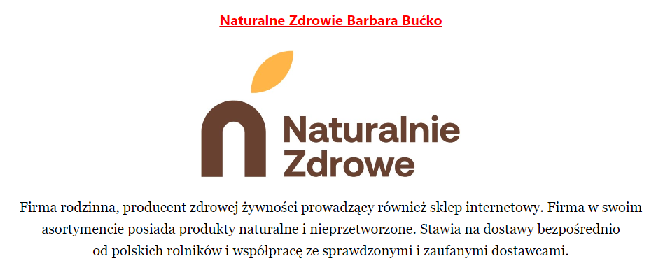
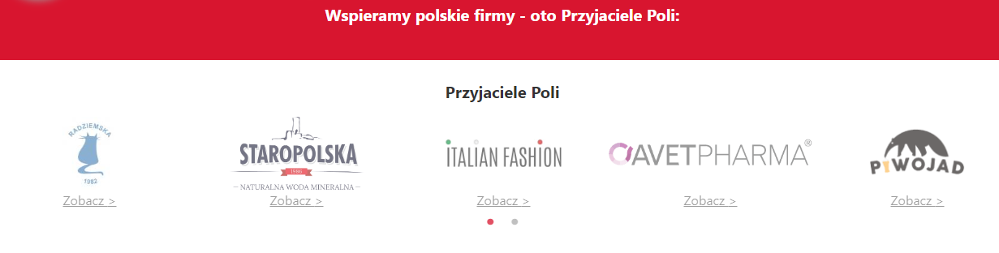

Grono Członków Klubu Przyjaciół Poli się powiększa!

Aplikacja Pola to nie tylko skaner kodów, ale także narzędzie wsparcia i promocji dla firm uzyskujących maksymalną liczbę punktów w naszym algorytmie. Bierzemy pod uwagę to, czy dana firma:

- produkuje w Polsce
- prowadzi prace badawczo rozwojowe w Polsce
- jest zarejestrowana w Polsce
- posiada wyłącznie polski kapitał
- nie należy do zagranicznego koncernu

Członkowie Klubu Przyjaciół Poli otrzymują możliwość posługiwania się znakiem towarowym „Polski produkt - 100 pkt Pola”, który można umieścić na produktach. Oprócz samego znaku towarowego status Przyjaciela Poli jest jednoznaczny z aktywnym udziałem w rozwoju aplikacji Pola. Zabierz ja na zakupy, której używa już ponad 750 000 użytkowników. Informacja o firmie znajduje w specjalnych zakładkach w aplikacji, na jej stronie internetowej, a także na stronie Klubu Jagiellońskiego, wydawcy aplikacji Pola. Dzięki czemu każdy konsument może poznać historię oraz profil działalności wszystkich współpracujących z Klubem Jagiellońskim przedsiębiorstw. Dodatkowo po zeskanowaniu produktu należącego do Przyjaciela Poli użytkownik zostanie poinformowany o jego specjalnym statusie.

Wszyscy Przyjaciele Poli mają możliwość aktywnego udziału w prowadzonych przez zespół aplikacji kampaniach społecznych oraz internetowych, mających na celu popularyzację polskich firm i patriotyzmu gospodarczego wśród obywateli.

Od dziś do [grona członków Klubu Przyjaciół Poli należy Naturalne Zdrowie Barbara Bućko!](https://www.pola-app.pl/friends). Firma rodzinna, producent zdrowej żywności prowadzący również sklep internetowy.

„Jeśli Polskę uważamy za swój dom i chcemy o niego dbać oraz patrzeć jak się rozwija,
warto dokonywać świadomych wyborów także w trakcie codziennych zakupów. Komu
płacimy za zakupione towary, naszym domownikom, czy bliższym lub bardziej odległym
sąsiadom, którzy jak pokazuje historia, niekoniecznie są nam przychylni. Aplikacja Pola
jasno wskazuje, kogo warto wspierać” - komentuje Adam Bućko.

Dołącz do grona [Klubu Przyjaciół aplikacji Pola!](https://www.pola-app.pl/friends)

