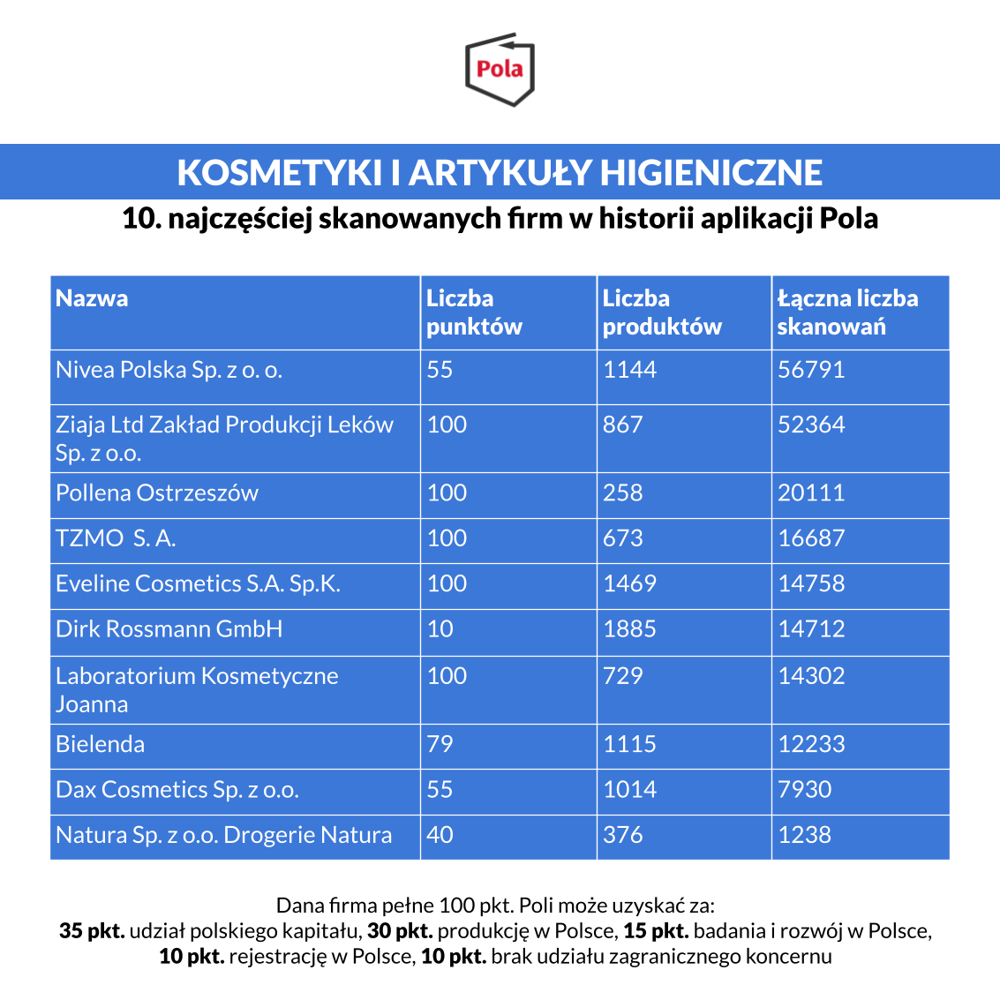

Moda na kupowanie polskich produktów staje się coraz silniejsza. Coraz więcej firm informuje konsumentów o polskim pochodzeniu swoich produktów. Dotyczy to nie tylko branży spożywczej. Nasz ranking przedstawia m.in. najpopularniejsze firmy z branży kosmetycznej. W zestawieniu znalazły się:

Nivea Polska Sp. z o. o., Ziaja Ltd Zakład Produkcji Leków Sp. z o.o., Pollena Ostrzeszów, Toruńskie Zakłady Materiałów Opatrunkowych S. A., Eveline Cosmetics S.A. Sp.K., Dirk Rossmann GmbH, Laboratorium Kosmetyczne Joanna, Bielenda, Dax Cosmetics Sp. z o.o. oraz Natura Sp. z o.o. (Drogerie Natura).

Pierwsze miejsce w zestawieniu zajęła Nivea Polska Sp. z o. o. z wynikiem 1144 produktów i 56791 skanowań, która w rankingu aplikacji Pola otrzymuje tylko 55. pkt. Raport jest [dostępny za darmo na stronie Klubu Jagiellońskiego](https://klubjagiellonski.pl/publikacje/polskie-produkty-nie-tylko-spozywcze-ranking-aplikacji-pola/), wydawcy aplikacji Pola. Znajdziemy w nim rankingi popularności z udziałem największych firm działających na polskim rynku w pięciu wybranych kategoriach. Łącznie do wszystkich firm ujętych w zestawieniu przypisano 30 665 produktów, które łącznie za pomocą aplikacji zeskanowano 256 509 razy.

Jeśli uważasz, że nasze działania są wartościowe, może pomóc w rozwoju naszego projektu. [Wspieraj aplikację Pola](https://klubjagiellonski.pl/zbiorka/wspieraj-aplikacje-pola/).
