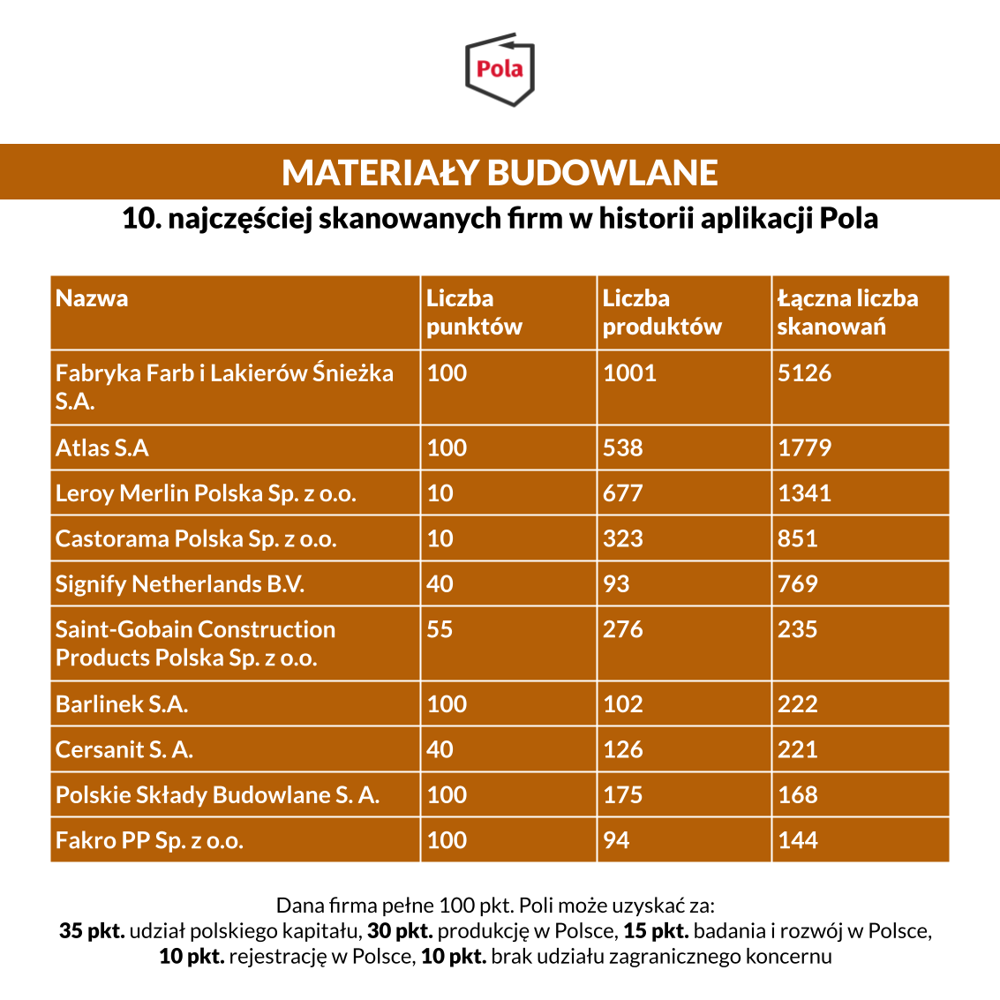

W branży budowlanej nie brakuje przykładów popularnych, polskich firm. Pokazuje to nowy raport aplikacji Pola. Zabierz ją na zakupy, wydawanej przez Klub Jagielloński. W zestawieniu znalazły się:

Fabryka Farb i Lakierów Śnieżka S.A., Atlas S.A, Leroy Merlin Polska Sp. z o.o., Castorama Polska Sp. z o.o., Signify Netherlands B.V., Saint-Gobain Construction Products Polska Sp. z o.o., Barlinek S.A., Cersanit S. A., Polskie Składy Budowlane S. A. oraz Fakro PP Sp. z o.o.

Pierwsze miejsce w zestawieniu zajęła Fabryka Farb i Lakierów Śnieżka S.A. z wynikiem 1001 produktów i 5126 skanowań. Raport jest [dostępny za darmo na stronie Klubu Jagiellońskiego](https://klubjagiellonski.pl/publikacje/polskie-produkty-nie-tylko-spozywcze-ranking-aplikacji-pola/), wydawcy aplikacji Pola. Znajdziemy w nim rankingi popularności z udziałem największych firm działających na polskim rynku w pięciu wybranych kategoriach. Łącznie do wszystkich firm ujętych w zestawieniu przypisano 30 665 produktów, które łącznie za pomocą aplikacji zeskanowano 256 509 razy.

Jeśli uważasz, że nasze działania są wartościowe, może pomóc w rozwoju naszego projektu. [Wspieraj aplikację Pola](https://klubjagiellonski.pl/zbiorka/wspieraj-aplikacje-pola/).
