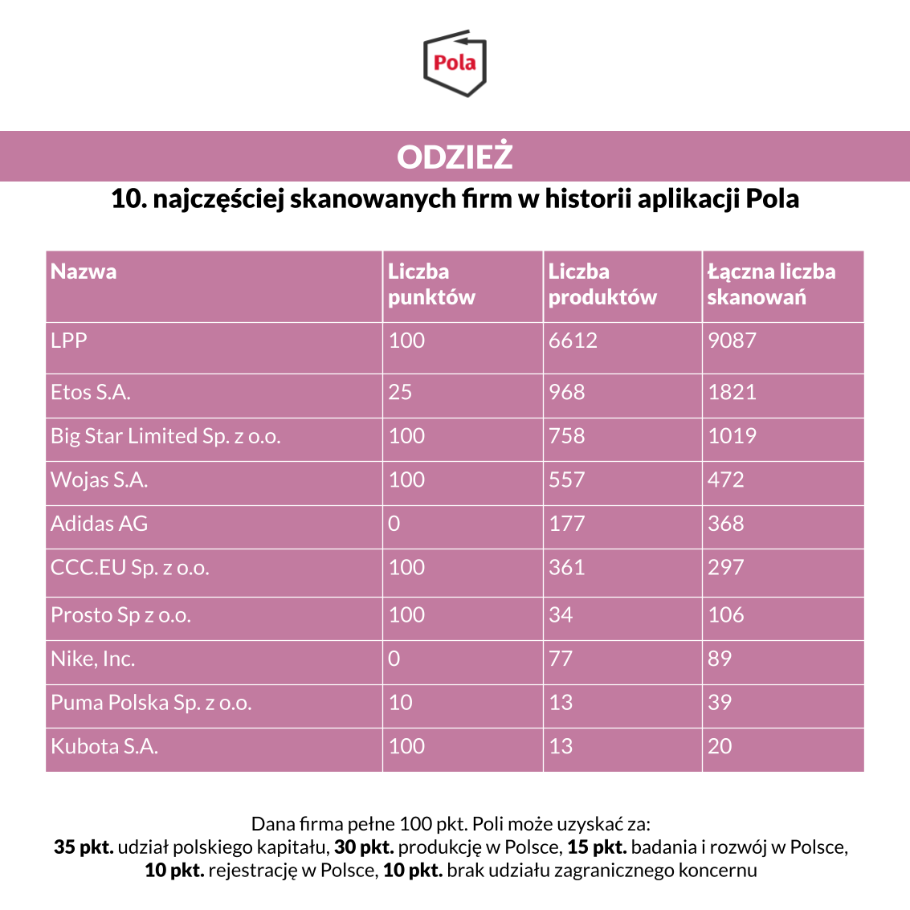

Polacy chcą kupować polskie produkty, ale mają problem z ich rozpoznaniem. Aplikacja Pola powstała po to, aby pomóc w weryfikacji każdego producenta. Staramy się działać w zupełnie nowych branżach, dlatego prezentujemy ranking firmy odzieżowych. W zestawieniu znalazły się:

LPP S.A., Etos S.A., Big Star Limited Sp. z o.o., Wojas S.A., Adidas AG, CCC.EU Sp. z o.o., Prosto Sp. z o.o., Nike, Inc., Puma Polska Sp. z o.o. oraz Kubota S.A.

Pierwsze miejsce w zestawieniu zajęła firma LPP S.A. z wynikiem 6612 produktów i 9087 skanowań. Raport jest [dostępny za darmo na stronie Klubu Jagiellońskiego](https://klubjagiellonski.pl/publikacje/polskie-produkty-nie-tylko-spozywcze-ranking-aplikacji-pola/), wydawcy aplikacji Pola. Znajdziemy w nim rankingi popularności z udziałem największych firm działających na polskim rynku w pięciu wybranych kategoriach. Łącznie do wszystkich firm ujętych w zestawieniu przypisano 30 665 produktów, które łącznie za pomocą aplikacji zeskanowano 256 509 razy.

Jeśli uważasz, że nasze działania są wartościowe, może pomóc w rozwoju naszego projektu. [Wspieraj aplikację Pola](https://klubjagiellonski.pl/zbiorka/wspieraj-aplikacje-pola/).
