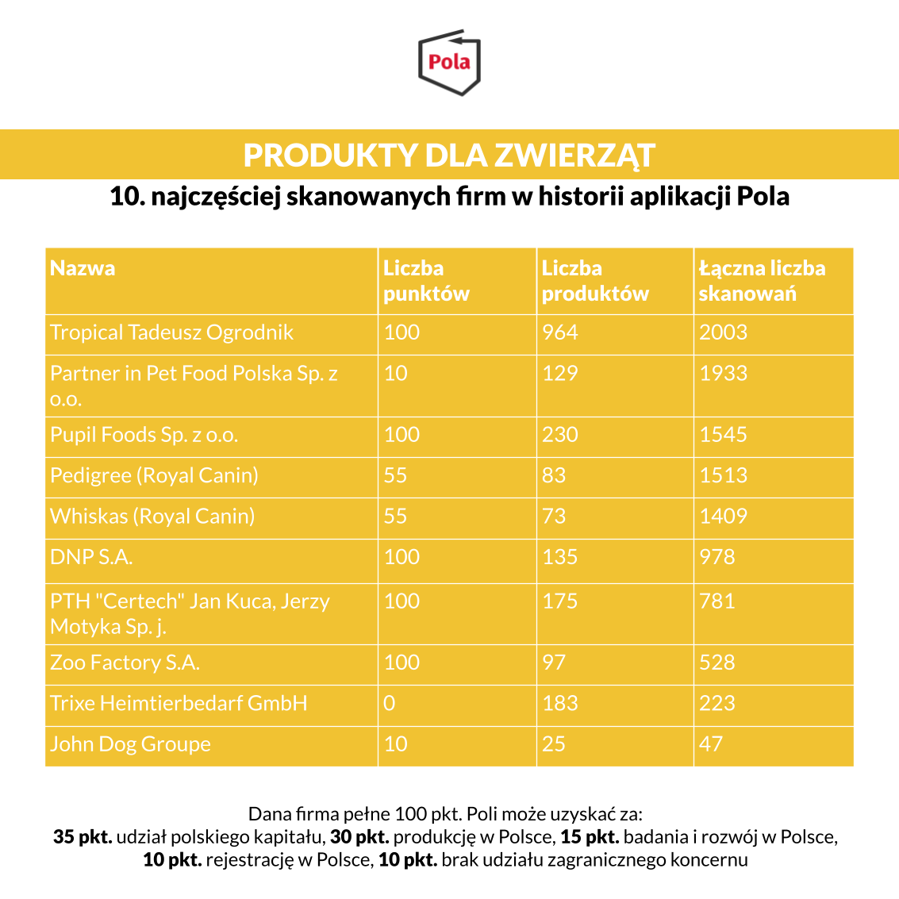

Za pomocą aplikacji Pola dokonano już pond 10 mln skanowań. Dzięki tej inicjatywie możemy znaleźć lokalne alternatywy dla międzynarodowych koncernów i nie tylko w branży spożywczej. Jeden z naszych rankingów przedstawia artykuły dla zwierząt. W zestawieniu znalazły się:

Tropical Tadeusz Ogrodnik, Partner in Pet Food Polska Sp. z o.o., Pupil Foods Sp. z o.o., Pedigree (Royal Canin), Whiskas (Royal Canin), DNP S.A., PTH "Certech" Jan Kuca, Jerzy, Motyka Sp. j., Zoo Factory S.A., Trixe Heimtierbedarf GmbH, John Dog Groupe oraz Super Zoo Sp. z o.o. (Kakadu).

Pierwsze miejsce w zestawieniu zajęła firma Tropical Tadeusz Ogrodnik z wynikiem 964 produktów i 2003 skanowań. Raport jest [dostępny za darmo na stronie Klubu Jagiellońskiego](https://klubjagiellonski.pl/publikacje/polskie-produkty-nie-tylko-spozywcze-ranking-aplikacji-pola/), wydawcy aplikacji Pola. Znajdziemy w nim rankingi popularności z udziałem największych firm działających na polskim rynku w pięciu wybranych kategoriach. Łącznie do wszystkich firm ujętych w zestawieniu przypisano 30 665 produktów, które łącznie za pomocą aplikacji zeskanowano 256 509 razy.

Jeśli uważasz, że nasze działania są wartościowe, może pomóc w rozwoju naszego projektu. [Wspieraj aplikację Pola](https://klubjagiellonski.pl/zbiorka/wspieraj-aplikacje-pola/).
