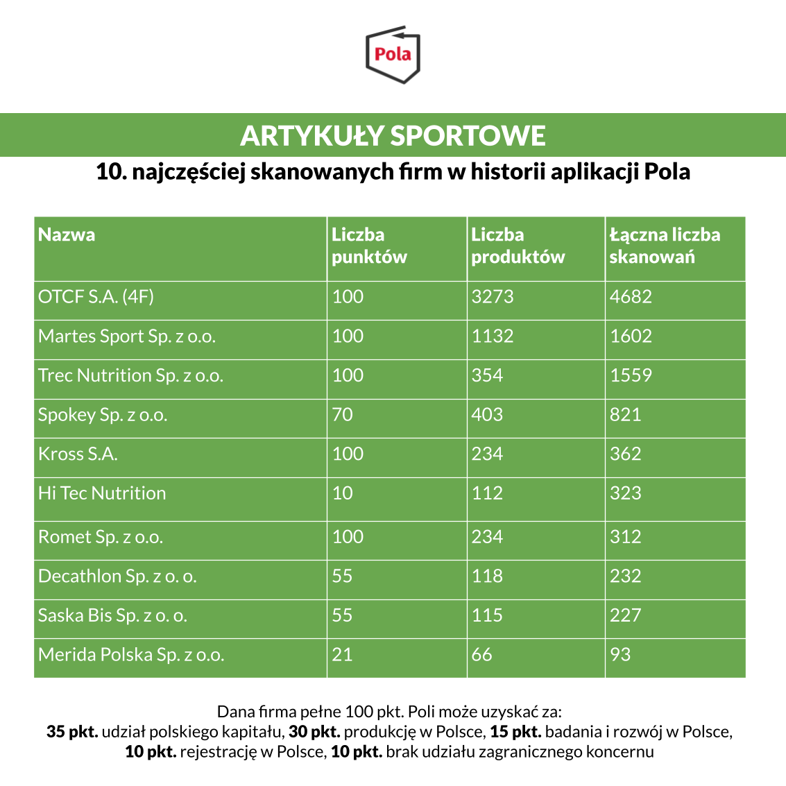

Chcemy, aby Pola służyła pomocą nie tylko w Biedronce i Lidlu, ale także w LeroyMerlin i Bricomarché. Dlatego prezentujemy rankingi popularności przedsiębiorstw w różnych kategoriach, ten dotyczy artykułów sportowych. W zestawieniu znalazły się:

OTCF S.A. (4F), Martes Sport Sp. z o.o., Trec Nutrition Sp. z o.o., Spokey Sp. z o.o., Kross S.A., Hi Tec Nutrition, Romet Sp. z o.o., Decathlon Sp. z o. o., Saska Bis Sp. z o. o. oraz Merida Polska Sp. z o.o.

Pierwsze miejsce w zestawieniu zajęło OTCF S.A. (4F) z wynikiem 3273 produktów i 4682 skanowań. Raport jest [dostępny za darmo na stronie Klubu Jagiellońskiego](https://klubjagiellonski.pl/publikacje/polskie-produkty-nie-tylko-spozywcze-ranking-aplikacji-pola/), wydawcy aplikacji Pola. Znajdziemy w nim rankingi popularności z udziałem największych firm działających na polskim rynku w pięciu wybranych kategoriach. Łącznie do wszystkich firm ujętych w zestawieniu przypisano 30 665 produktów, które łącznie za pomocą aplikacji zeskanowano 256 509 razy.

Jeśli uważasz, że nasze działania są wartościowe, może pomóc w rozwoju naszego projektu. [Wspieraj aplikację Pola](https://klubjagiellonski.pl/zbiorka/wspieraj-aplikacje-pola/).
