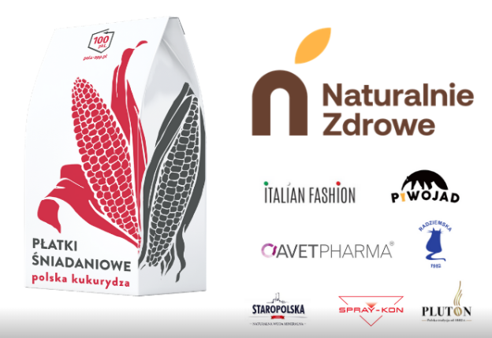

W kalendarzu znajdziemy wiele różnych wydarzeń nawiązujących do popularnych produktów spożywczych. Mamy dzień pizzy, jabłka czy soku. 16 października przypada dzień chleba. To dobra okazja, by przypomnieć o ofercie jednego z członków Klubu Przyjaciół Poli.

Aplikacja Pola to nie tylko skaner kodów, ale także narzędzie wsparcia i promocji dla firm uzyskujących maksymalną liczbę punktów w naszym algorytmie. Bierzemy pod uwagę to, czy dana firma:

- produkuje w Polsce
- prowadzi prace badawczo rozwojowe w Polsce
- jest zarejestrowana w Polsce
- posiada wyłącznie polski kapitał
- nie należy do zagranicznego koncernu

[Członkowie Klubu Przyjaciół Poli](https://www.pola-app.pl/friends) otrzymują możliwość posługiwania się znakiem towarowym „Polski produkt - 100 pkt Pola”, który można umieścić na produktach. Oprócz samego znaku towarowego status Przyjaciela Poli jest jednoznaczny z aktywnym udziałem w rozwoju aplikacji Pola. Zabierz ja na zakupy, której używa już ponad 750 000 użytkowników.

Informacja o firmie znajduje w specjalnych zakładkach w aplikacji, na jej stronie internetowej, a także na stronie Klubu Jagiellońskiego, wydawcy aplikacji Pola. Dzięki czemu każdy konsument może poznać historię oraz profil działalności wszystkich współpracujących z Klubem Jagiellońskim przedsiębiorstw. Dodatkowo po zeskanowaniu produktu należącego do Przyjaciela Poli użytkownik zostanie poinformowany o jego specjalnym statusie.

Wszyscy Przyjaciele Poli mają możliwość aktywnego udziału w prowadzonych przez zespół aplikacji kampaniach społecznych oraz internetowych, mających na celu popularyzację polskich firm i patriotyzmu gospodarczego wśród obywateli.

Jednym z członków Klubu Przyjaciół Poli jest Naturalne Zdrowie Barbara Bućko to firma rodzinna, producent zdrowej żywności prowadzący również sklep internetowy. Firma w swoim asortymencie posiada produkty naturalne i nieprzetworzone. Znajdziemy tam mieszanki chlebowe różnych rodzajów pieczywa, które pozwalają w łatwy sposób przygotować świeże wypieki.
