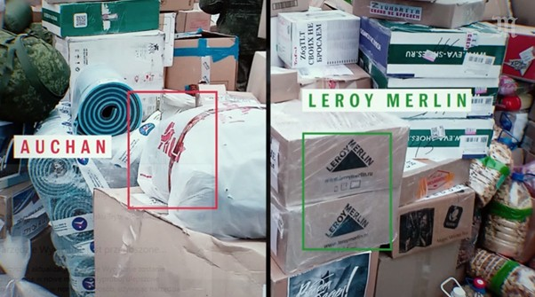
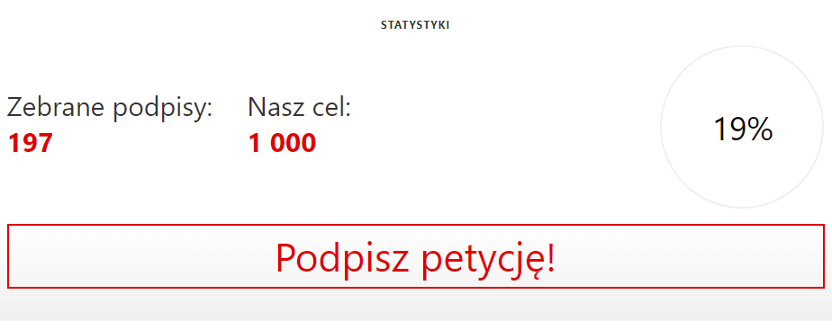

**Francuskie firmy rodziny „Mulliez” od 24.02.2022 szokują kolejnymi decyzjami, przede wszystkim – pozostały na rosyjskim rynku. Według doniesień medialnych odcięły pracowników ukraińskich sklepów od komunikacji z kolegami z zagranicy i ochoczo współpracowały z rosyjskimi służbami w celu mobilizowania pracowników sieci na front. Najnowsze międzynarodowe śledztwo doszczętnie rujnuje reputację firm. Auchan i pozostałe marki miały być zaangażowane w organizowanie wsparcia dla rosyjskich wojsk biorących udział w inwazji na Ukrainę. Klub Jagielloński i aplikacja Pola rozpoczynają akcję, która daje Auchan prosty wybór: jeśli wciąż nie jesteście gotowi wyjść z Rosji, to opuście polski rynek! Niech we francuskiej sieci zobaczą, że wbrew ich marketingowemu sloganowi „nie zawsze się opłaca”.**

Działanie marek należących do grupy kapitałowej rodziny „Mulliez” od początku rosyjskiej inwazji na Ukrainę zadziwia i wywołuje fale masowej krytyki. Auchan, Leroy Merlin i Decathlon stały się wręcz symbolami biznesu, który jest w stanie przymykać oko na zbrodnie – byle tylko wykresy prezentujące zyski osiągały zamierzone poziomy.

„Auchan, Leroy Merlin i Decathlon zapowiedziały, że (…) będą dalej prowadzić liczne sklepy, które posiadają w Federacji Rosyjskiej (…). Wytłumaczeniem jest zapewne rozmiar zaangażowania grupy w Rosji – 18% całkowitego przychodu Leroy Merlin i 10% Auchan” – [pisał](https://klubjagiellonski.pl/2022/03/23/dlaczego-leroy-merlin-wciaz-dziala-w-rosji-polityka-ciecie-kosztow-pr-i-na-szarym-koncu-etyka/) na naszych łamach blisko rok temu Adam Zych.

Kontrowersyjnych doniesień było jeszcze więcej. U szczytu konsumenckiego wzburzenia, gdy w mgnieniu oka powstawały [listy wstydu](https://klubjagiellonski.pl/2022/04/07/zawieszenie-dzialalnosci-warwashing-business-as-usual-globalne-korporacje-w-rosji/) z nazwami firm, które wciąż nie opuściły Rosji, firma Leroy Merlin postanowiła utrudnić przepływ informacji i odcięła 800 ukraińskich pracowników od wewnętrznej firmowej komunikacji. Jak [podawała](https://wyborcza.biz/biznes/7,177151,28244475,leroy-merlin-odcial-800-ukrainskich-pracownikow-od-wewnetrznej.html?disableRedirects=true) wówczas Wyborcza: „Dla wielu był to jedyny sposób kontaktu z kolegami z pracy, którzy organizują pomoc na miejscu i wyjazdy do Polski”.

Następnie pojawiły się [doniesienia](https://biznes.interia.pl/gospodarka/news-auchan-zaangazowane-w-rosyjska-wojne-w-ukrainie-wyniki-dzien,nId,6603865) o tym, że rosyjskie oddziały Auchan przekazywały dane swoich pracowników urzędom rekrutacyjnym, pomagając wysyłać ich na front w ramach mobilizacji. Sieć miała także pozwalać na wręczanie wezwań wojskowych na terenie sklepu w czasie wykonywania pracy. To kolejny przykład na to, jak bardzo działania firm z tej grupy różnią się od powszechnych, moralnych zachowań.

**Jednak najnowsze doniesienia doszczętnie rujnują reputację firm. Wspólne śledztwo [„Le Monde”](https://www.lemonde.fr/m-le-mag/article/2023/02/17/les-distributions-troubles-d-auchan-en-russie_6162177_4500055.html), [Bellingcat](https://www.bellingcat.com/) i [The Insider](https://theins.ru/en/politics/259460) wskazuje, że były zaangażowane w organizowanie pomocy dla rosyjskich wojsk biorących udział w inwazji na Ukrainę. Redakcje dotarły do wiadomości wysyłanych sobie przez pracowników oraz listy produktów wkładanych do paczek. Nie było tam ani produktów dla kobiet, ani artykułów dziecięcych. Było za dużo męskich skarpet i papierosów, a także brzytwy i zapalniczki.**

Opisywał to m.in. portal [Biełsat](https://belsat.eu/pl/news/17-02-2023-rosyjski-auchan-dostarczal-pomoc-wojskowym-na-front-rezultaty-miedzynarodowego-sledztwa), zamieszczając również film, z którego pochodzi screen:

Źródło: [https://belsat.eu/pl/news/17-02-2023-rosyjski-auchan-dostarczal-pomoc-wojskowym-na-front-rezultaty-miedzynarodowego-sledztwa](https://belsat.eu/pl/news/17-02-2023-rosyjski-auchan-dostarczal-pomoc-wojskowym-na-front-rezultaty-miedzynarodowego-sledztwa)

Dlatego zwracamy się do sieci Auchan z apelem o ponowne rozważenie decyzji o opuszczenie rynku Federacji Rosyjskiej. Miniony rok jednoznacznie pokazał, że nie ma miejsca na jakiekolwiek pole współpracy, a nawet bierne działanie w państwie ponoszącym odpowiedzialność za bestialską inwazję na Ukrainę.

**Oczekujemy od sieci tej spóźnionej, ale koniecznej decyzji. Jeśli jednak nie zamierzają opuszczać terenu Federacji Rosyjskiej, to apelujemy o opuszczenie Polski. Chcemy uświadomić, że wbrew sloganowi sieci Auchan „nie zawsze się opłaca”.**

Decyzja o pozostaniu na rosyjskim rynku skutkuje wplątywaniem punktów sieci Auchan w szereg moralnie wątpliwych i nieweryfikowalnych procederów z udziałem zbrodniczego, rosyjskiego reżimu. Zarzuty takie jak te sformułowane przez „Le Monde”, Bellingcat i The Insider są oczywistą konsekwencją decyzji podjętych przez firmę tuż po wybuchu wojny, w czasie gdy zdecydowana większość korporacji krajów Zachodu wycofywała się z rynku rosyjskiego.

**Gdyby wówczas sieć zachowała się przyzwoicie – dziś nie musiałaby zmagać się z kolejnym wizerunkowym kryzysem. W ostatnim roku doszło do całkowitej utraty zaufania do władz sieci Auchan. Dlatego formułowane przez firmę wyjaśnienia i deklaracje są niewiarygodne i niewystarczające.**

Równolegle Klub Jagielloński, jako inicjator niniejszej petycji, podejmuje szereg działań, które bądź to skłonią sieć do opuszczenia rosyjskiego rynku, bądź też przyspieszą decyzję Auchan o opuszczeniu polskiego rynku. Mamy nadzieję, że w razie pozostania na rynku rosyjskim niebawem działalność w naszym kraju zwyczajnie przestanie się im kalkulować.

**100 najpopularniejszych polskich firm, której w wydawanej przez Klub Jagielloński aplikacja Pola otrzymują maksymalną liczbę punktów, a ich produkty znajdują się w ofercie Auchan, otrzymało od nas właśnie wezwanie do działania. Prosimy te firmy o ustosunkowanie się do możliwości wycofania swoich produktów z sieci, a także o inne możliwe formy ograniczenia współpracy z Auchan.**

Jesteśmy przekonani, że polscy przedsiębiorcy, którzy poświęcili wiele środków na pomoc Ukraińcom i Ukrainie, gruntownie rozważą sens kontynuacji współpracy z podmiotem, który nie potrafił przez rok podjąć podstawowych decyzji.

Równocześnie wzywamy wszystkich Polaków i mieszkających w naszym kraju Ukraińców do dalszego omijania sieci, jak również pozostałych firm rodziny Mulliez, takich jak Leroy Merlin i Decathlon.

Jesteśmy przekonani, że odważne decyzje polskich przedsiębiorców i krajowych konsumentów pozwolą sieci podjąć słuszną decyzję. Wciąż mamy nadzieję, że Auchan wybierze Polskę zamiast Rosji.

### [Podpisz petycję](https://klubjagiellonski.pl/petycje/auchan-zrozum-ze-nie-zawsze-sie-oplaca-petycja/)

**Stan licznika petycji o 14:44 28.02**

**Lista 100 najpopularniejszych firm z oceną 100 pkt w aplikacji Pola, których produkty są obecne w sieci Auchan. Każda z nich otrzymała wiadomość z prośbą o wskazanie, jakie działania może podjąć w tej sprawie:**

1. Aflofarm Farmacja Polska Sp. z o.o.
2. Agros-Nova S.A.
3. Agros-Nova soki Sp. z o.o.
4. Aksam Sp. z o. o. Sp.k.
5. Avit Adam Rytel
6. Bakoma Sp. z o.o.
7. Barwa Sp. z o.o.
8. BiFIX Wojciech Piasecki Sp.j
9. Big-Active Sp. z o. o.
10. Bracia Sadownicy Sp. z o. o.
11. Browar Amber Sp. z o. o.
12. Browar Jabłonowo Zarząd Sp.  z o. o. Sp. K.
13. Browar Kormoran Sp. z o.o.
14. Browary Regionalne Jakubiak Sp. z o.o.
15. BZK Alco Spółka Akcyjna
16. Cechini – Dystrybucja Sp. z o.o.
17. Colian sp. z o.o.
18. Cykoria S.A.
19. Dawtona Sp. z o. o.
20. Dramers S.A.
21. Drink ID Sp. z o.o.
22. Dystrybucja Pomorze Sp. z o.o.
23. Elfa Pharm Polska Sp. z o.o. Sp. k.
24. Eveline Cosmetics S.A. S.K.A.
25. Fabryka Cukiernicza Kopernik S.A.
26. Firma Handlowa Rolnik Sp. j.
27. FoodCare Spółka z o.o.
28. Fortuna Sp. z o.o.
29. Granex Sp. z o.o.
30. Grupa Inco S.A.
31. Helio S.A.
32. Herbapol – Lublin S.A.
33. Hoop Polska SP. z o. o.
34. Huzar Sp. z o.o.
35. Interdruk S.A.
36. Jawo Sp. z o.o.
37. Krajowa Spółka Cukrowa S.A.
38. Kupiec Sp. z o.o.
39. Laboratorium Kosmetyczne Dr Irena Eris sp. z o.o.
40. Laboratorium Kosmetyczne Joanna
41. Laboratorium Kosmetyków Naturalnych Farmona Sp. z o.o.
42. Lakma Sat Sp. z o.o.
43. Lodziarnie Firmowe Sp. z o.o. Sp. k.
44. Lubella Sp. z o.o. Sp. k.
45. Makarony Polskie S.A.
46. Maspex – GMW Sp. z o.o. Sp. k
47. Melvit S.A.
48. Millano Sp. z o.o. S.K.A.
49. Mleczarnia EkoŁukta Sp. z o.o.
50. Mokate S.A.
51. Nałęczów Zdrój S.A.
52. Oceanic S.A.
53. Okręgowa Spółdzielnia Mleczarska w Krasnymstawie
54. Oleofarm Sp. z o.o.
55. Olimp Laboratories Sp. z o.o.
56. OSM Piątnica
57. OSM w Łowiczu
58. OSM w Sierpcu
59. P. P. L. Koral Sp. j.
60. P.P.U.H. Woseba Sp. z o.o.
61. Pharma C-Food Sp. z o.o.
62. Piekarnia Oskroba S.A
63. Piwniczanka Spółdzielnia Pracy
64. Pollena P.Ch.G. Sp. z o. o.
65. Polmlek Sp. z o.o.
66. Polskie Młyny S.A.
67. Polsoja Sp. z o.o.
68. Prymat Sp. z o.o.
69. Purella Sp. z o.o.
70. PW Spomet Sp. j
71. Roleski Spółka Jawna
72. Sante A. Kowalski Sp. Jawna
73. Serpol-Cosmetics Spółka z o.o. Sp. k.
74. Sertop sp. z o.o.
75. Sokpol Sp. z o.o.
76. Spółdzielnia Mleczarska Mlekovita
77. Spółdzielnia Mleczarska Mlekpol w Grajewie
78. Spółdzielnia Mleczarska w Gostyniu
79. Spółdzielnia Pracy Muszynianka
80. St. Majewski S.A. Sp. k
81. Średzka Spółdzielnia Mleczarska Jana
82. Tago Przedsiębiorstwo Przemysłu Cukierniczego Tadeusz Gołębiewski
83. Terravita sp. z o.o.
84. Toruńskie Zakłady Materiałów Opatrunkowych S.A.
85. Trefl S.A.
86. Tymbark – MWS Sp. z o.o. Sp. k.
87. Ustronianka Sp. z o.o.
88. Uzdrowiska Kłodzkie S.A.
89. Van Pur S.A.
90. Victoria Cymes Sp. z o.o.
91. Victus Mielczarek i Kowalska Sp. j.
92. Wosana S.A.
93. WSP Społem
94. Z.P.H.U. Inex Sp. z o.o.
95. Z.P.S. Jamar Szczepaniak Sp. j.
96. Zakłady Mięsne „Pekpol Ostrołęka” S.A.
97. Zakłady Tłuszczowe Bielmar Sp.z o.o.
98. Zbyszko Bojanowicz Sp. z o. o.
99. Ziaja Ltd Zakład Produkcji Leków Sp. z o.o.
100. ZPC Skawa S.A.
